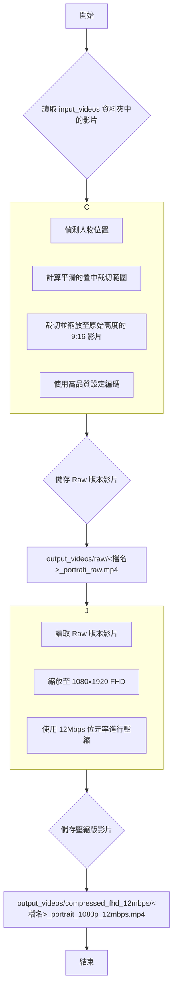

# Auto Reframe Videos - 自動影片追蹤直向轉換工具

這是一個 Python 腳本，可以自動將橫向的影片（例如 16:9）轉換為適合手機觀看的直向影片（9:16）。它會自動偵測畫面中的人物、將其置於畫面中心，並提供流暢的虛擬運鏡效果。

## ✨ 功能特性

- **全自動人物追蹤**：使用 MediaPipe 進行高效能的人體姿勢偵測。
- **智慧運鏡平滑化**：內建指數移動平均 (EMA) 演算法，防止畫面跳動，產生穩定流暢的追蹤效果。
- **雙版本輸出**：一次處理，產生兩種影片版本：
  1.  **Raw (母片)**：與原始影片等高的 `mp4` 檔案，保留最佳品質以便後續編輯。
  2.  **壓縮版**：適合直接發布的 `1080x1920` FHD 影片，位元率控制在 12Mbps。
- **高效能編碼**：
  - **自動偵測硬體加速**：優先尋找並使用 NVIDIA (NVENC), Intel (QSV), AMD (AMF) 硬體編碼器，大幅提升處理速度。
  - **智慧退回機制**：若未找到硬體編碼器，會自動切換至高品質的 `libx264` 軟體編碼模式。
- **保留原始音訊**：處理後的影片會完整保留原始的音訊內容。
- **縮圖產生優化**：透過 `-movflags +faststart` 參數，確保影片在檔案總管中能正常顯示預覽縮圖。

## ⚙️ 處理流程



## 📦 環境需求與安裝

1.  **Python 3.8+**
2.  **FFmpeg**：請確保已安裝 FFmpeg，並將其執行檔路徑加入系統的環境變數 `PATH` 中。
3.  **Python 函式庫**：
    - 複製本專案後，開啟命令列，進入專案根目錄。
    - 執行以下指令以安裝所有必要的函式庫：
    ```bash
    pip install -r requirements.txt
    ```

## 🚀 如何使用

1.  將您想轉換的影片檔案放入 `input_videos` 資料夾。
2.  開啟命令列 (Terminal / Command Prompt)，直接執行 Python 腳本：
    ```bash
    python reframe_video.py
    ```
3.  處理完成的影片將會根據版本，分別儲存在 `output_videos` 下的對應資料夾中。

## 📂 輸出檔案結構

處理完成後，`output_videos` 資料夾中將包含兩個子資料夾：

1.  **`raw/`**
    - 存放高品質、高解析度的母片版本。
    - 檔名：`<原始檔名>_portrait_raw.mp4`
    - 這個版本適合用於需要二次剪輯或對畫質有極高要求的場景。

2.  **`compressed_fhd_12mbps/`**
    - 存放壓縮過的 FHD 版本，檔案較小，適合直接上傳到社群媒體。
    - 檔名：`<原始檔名>_portrait_1080p_12mbps.mp4`

## 🔧 參數調整 (可選)

您可以透過修改 `reframe_video.py` 檔案中的參數來微調效果：

- **`SMOOTHING_FACTOR`** (預設 `0.02`)
  - 此參數控制運鏡的平滑程度。
  - **數值越小**：運鏡越平滑、越穩定，但跟隨速度較慢（建議 `0.02` ~ `0.05` 來抑制抖動）。
  - **數值越大**：運鏡跟隨越緊、反應越快，但平滑感會降低。

- **`LANDMARK_DETECTION_INTERVAL`** (預設 `3`)
  - 每隔多少格畫面進行一次人物偵測。增加此數值可以降低 CPU 使用率，但可能會影響跟隨的精準度。

---

## ⚡ GPU 加速說明

本腳本支援兩種層面的 GPU 加速，兩者可以獨立運作：

1.  **編碼加速 (Encoding)**：由 **FFmpeg** 處理，負責將影片畫面壓縮成 `mp4` 檔案。
    - **支援**：NVIDIA (NVENC), Intel (QSV), AMD (AMF)。
    - **設定**：通常只需要安裝最新的顯示卡驅動程式，並使用支援這些技術的 FFmpeg 版本即可。**本腳本會自動偵測並啟用**。

2.  **推論加速 (Inference)**：由 **MediaPipe** 處理，負責偵測人物位置。
    - **支援**：NVIDIA (CUDA)。
    - **設定**：需要較為複雜的環境設定 (安裝 CUDA Toolkit, cuDNN)。這可以提升人物偵測的速度，對於 CPU 較弱的電腦有幫助。

**結論：** 對於大多數使用者，確保 FFmpeg 可以使用**編碼加速**即可獲得最大的時間節省。以下的教學主要針對希望進一步啟用 MediaPipe **推論加速** 的使用者。

#### MediaPipe 推論加速設定教學 (Windows + NVIDIA)

為了獲得極致的處理速度，建議設定 GPU 加速環境。

##### 步驟 1：更新 NVIDIA 顯示卡驅動程式
請至 NVIDIA 官網下載並安裝適用於您顯示卡的最新版 `Game Ready` 或 `Studio` 驅動程式。

##### 步驟 2：安裝 CUDA Toolkit
MediaPipe 通常需要特定版本的 CUDA。一個相對安全且廣泛支援的版本是 **CUDA 11.x** 系列。我們以 **11.8** 為例：

1.  前往 NVIDIA 的 [CUDA Toolkit 11.8 下載頁面](https://developer.nvidia.com/cuda-11-8-0-download-archive)。
2.  選擇您的系統 (`Windows`, `x86_64`, `10`/`11`, `exe (local)`)。
3.  下載並執行安裝程式，建議選擇「**Express (推薦)**」進行完整安裝。

##### 步驟 3：安裝 cuDNN
cuDNN 是用於深度學習的 GPU 加速函式庫，必須與 CUDA 版本對應。

1.  前往 NVIDIA 的 [cuDNN 下載頁面](https://developer.nvidia.com/rdp/cudnn-archive) (可能需要註冊免費的 NVIDIA Developer 帳號)。
2.  找到與您剛才安裝的 CUDA 11.8 對應的版本，例如 `cuDNN v8.9.7 for CUDA 11.x`。
3.  點擊下載 `Local Installer for Windows (Zip)`。
4.  解壓縮 Zip 檔後，將裡面的 `bin`, `include`, `lib` 等資料夾複製到 CUDA 的安裝路徑下（預設為 `C:\Program Files\NVIDIA GPU Computing Toolkit\CUDA\v11.8`），並在提示時選擇合併與取代檔案。

##### 步驟 4：設定環境變數
1.  開啟系統的「編輯系統環境變數」。
2.  在「系統變數」中找到 `Path` 變數，點擊「編輯」。
3.  確認以下兩個路徑是否存在，若無請手動「新增」：
    - `C:\Program Files\NVIDIA GPU Computing Toolkit\CUDA\v11.8\bin`
    - `C:\Program Files\NVIDIA GPU Computing Toolkit\CUDA\v11.8\libnvvp`

##### 步驟 5：驗證
完成以上設定後，重新啟動您的命令列工具（或直接重開機），然後再次執行 `python reframe_video.py`。

如果您在程式初期的日誌中看到 `INFO: Created TensorFlow Lite delegate for GPU.`，即代表 MediaPipe 的 GPU 推論加速已成功啟用。

## ⚠️ 疑難排解

- **`FileNotFoundError: [WinError 2] 系統找不到指定的檔案。` (在執行 ffmpeg 時)**
  - **原因**：系統找不到 `ffmpeg.exe`。
  - **解決**：請確認您已正確安裝 FFmpeg，並將其 `bin` 資料夾的路徑新增至系統的環境變數 `PATH` 中。

- **硬體編碼器未成功偵測**
  - **原因**：可能是驅動程式或 FFmpeg 版本問題。
  - **解決**：程式會自動退回到高品質的 CPU 模式繼續執行，不影響最終結果，但處理速度會較慢。